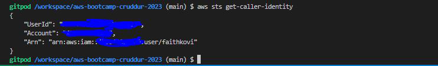
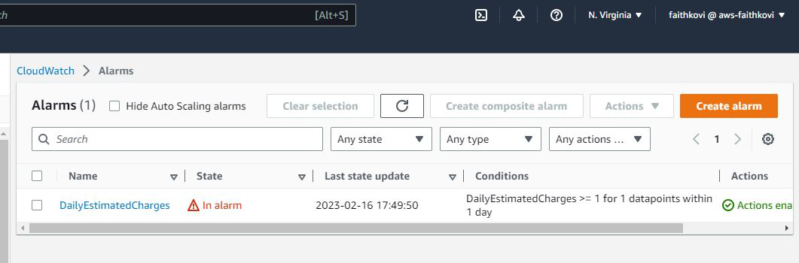
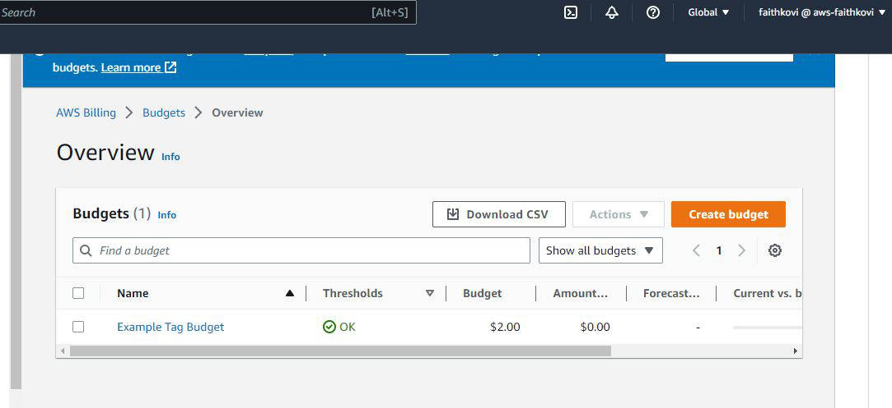
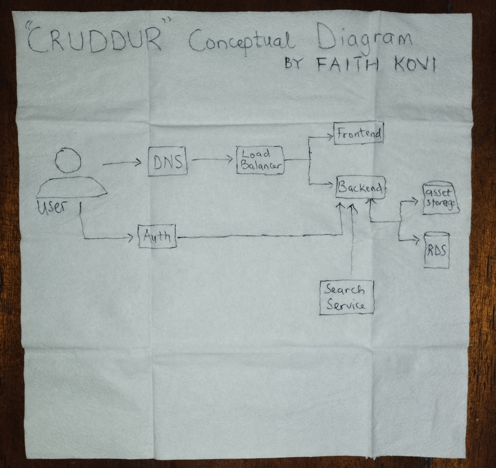
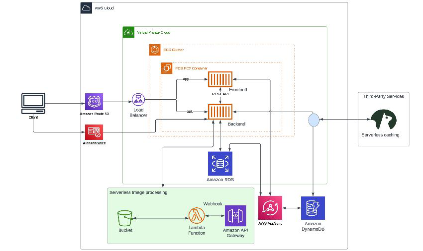

# Week 0 — Billing and Architecture

## Required Homework/Tasks

### Install and Verify AWS CLI 
I was able to install and verify the AWS CLI on Gitpod. I also attempted installing it on my local machine.

I followed the instructions here - [AWS CLI installation guide](https://docs.aws.amazon.com/cli/latest/userguide/getting-started-install.html)

For the installation on my Gitpod, I used the instructions for *Linux* while I used the instructions for *Windows* on my local machine.

### Create Billing Alarm

I created a billing alarm using AWS CLI

### Create Budget

I created my budget of $2 using AWS CLI as that is my hard stop on what I can afford on my account currently.

### Architecture Diagrams

1. Recreate Conceptual Diagram in Lucid Charts or on a Napkin

[Link to the conceptual diagram I recreated on Lucid chart](https://lucid.app/lucidchart/16eed53f-6f79-4ee4-bedc-a1948e5faf0d/edit?viewport_loc=-450%2C-247%2C1988%2C1009%2C0_0&invitationId=inv_2c120c99-1787-4e45-a70a-9f92df53b2ec)

2. Recreate Logical Architectual Diagram in Lucid Charts

[Link to the logical diagram I created on Lucid charts](https://lucid.app/lucidchart/84c1fbeb-2d78-4a5d-b3a7-fd25bfef6d03/edit?viewport_loc=-360%2C244%2C2554%2C1297%2C0_0&invitationId=inv_086abaed-b0ce-4f3d-8a91-68dba65213f9)

### Homework Challenges
For the homework challenges, I was able to do the following:

- [x] Set MFA and create IAM role.

- [x] Review all the questions of each pillars in the Well Architected Tool 

- [x] Research the technical and service limits of specific services and how they could impact the technical path for technical flexibility. 

### Other Tasks

I was able to create an Admin User, generate AWS credentials for that user and use cloudshell on AWS Management Console.
