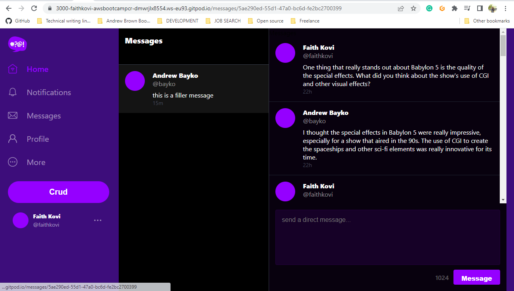
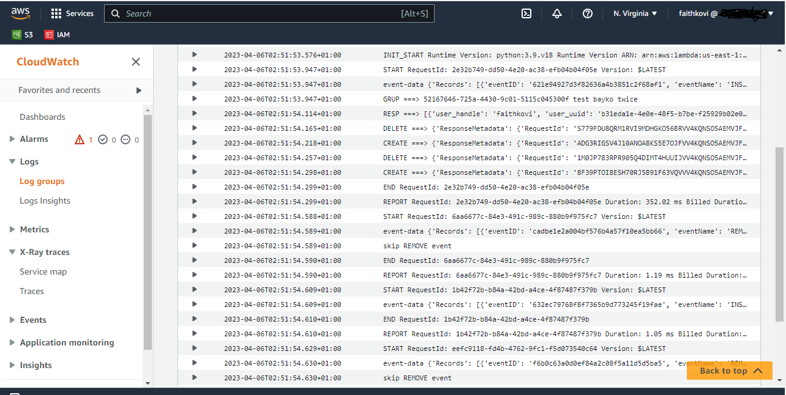

# Week 5 — DynamoDB and Serverless Caching

I was able to complete the homework challenges 

Proof shown below

## Dynamodb local implementation


## Dynamodb production implementation


## Dynamodb production logs
Attaching ```AmazonDynamodbFullAccess``` policy to the execution role of the lambda function worked perfectly fine for me with no errors.



## DynamoDB Bash Scripts

```sh
./bin/ddb/schema-load
```


## The Boundaries of DynamoDB

- When you write a query you have provide a Primary Key (equality) eg. pk = 'andrew'
- Are you allowed to "update" the Hash and Range?
  - No, whenever you change a key (simple or composite) eg. pk or sk you have to create a new item.
    - you have to delete the old one
- Key condition expressions for query only for RANGE, HASH is only equality 
- Don't create UUID for entity if you don't have an access pattern for it


3 Access Patterns

## Pattern A  (showing a single conversation)

A user wants to see a list of messages that belong to a message group
The messages must be ordered by the created_at timestamp from newest to oldest (DESC)

```sql
SELECT
  messages.uuid,
  messages.display_name,
  messages.message,
  messages.handle,
  messages.created_at -- sk
FROM messages
WHERE
  messages.message_group_uuid = {{message_group_uuid}} -- pk
ORDER BY messages.created_at DESC
```

> message_group_uuid comes from Pattern B

## Pattern B (list of conversation)

A user wants to see a list of previous conversations.
These conversations are listed from newest to oldest (DESC)
We want to see the other person we are talking to.
We want to see the last message (from whomever) in summary.

```sql
SELECT
  message_groups.uuid,
  message_groups.other_user_uuid,
  message_groups.other_user_display_name,
  message_groups.other_user_handle,
  message_groups.last_message,
  message_groups.last_message_at
FROM message_groups
WHERE
  message_groups.user_uuid = {{user_uuid}} --pk
ORDER BY message_groups.last_message_at DESC
```

> We need a Global Secondary Index (GSI)

## Pattern C (create a message)

```sql
INSERT INTO messages (
  user_uuid,
  display_name,
  handle,
  creaed_at
)
VALUES (
  {{user_uuid}},
  {{display_name}},
  {{handle}},
  {{created_at}}
);
```

## Pattern D (update a message_group for the last message)

When a user creates a message we need to update the conversation
to display the last message information for the conversation

```sql
UPDATE message_groups
SET 
  other_user_uuid = {{other_user_uuid}}
  other_user_display_name = {{other_user_display_name}}
  other_user_handle = {{other_user_handle}}
  last_message = {{last_message}}
  last_message_at = {{last_message_at}}
WHERE 
  message_groups.uuid = {{message_group_uuid}}
  AND message_groups.user_uuid = {{user_uuid}}
```


## Serverless Caching

### Install Momento CLI tool

In your gitpod.yml file add:

```yml
  - name: momento
    before: |
      brew tap momentohq/tap
      brew install momento-cli
```

### Login to Momento

There is no `login` you just have to generate an access token and not lose it. 
 
You cannot rotate out your access token on an existing cache.

If you lost your cache or your cache was comprised you just have to wait for the TTL to expire.

> It might be possible to rotate out the key by specifcing the same cache name and email.

 ```sh
 momento account signup aws --email ******@****** --region us-east-1
 ```

### Create Cache

```sh
export MOMENTO_AUTH_TOKEN=""
export MOMENTO_TTL_SECONDS="600"
export MOMENTO_CACHE_NAME="cruddur"
gp env MOMENTO_AUTH_TOKEN=""
gp env MOMENTO_TTL_SECONDS="600"
gp env MOMENTO_CACHE_NAME="cruddur"
```

> you might need to do `momento configure` since it might not pick up the env var in the CLI.

Create the cache:

```sh
momento cache create --name cruddur
```


### DynamoDB Stream trigger to update message groups

- create a VPC endpoint for dynamoDB service on your VPC
- create a Python lambda function in your vpc
- enable streams on the table with 'new image' attributes included
- add your function as a trigger on the stream
- grant the lambda IAM role permission to read the DynamoDB stream events

`AWSLambdaInvocation-DynamoDB`

- grant the lambda IAM role permission to update table items


**The Function**

```.py
import json
import boto3
from boto3.dynamodb.conditions import Key, Attr

dynamodb = boto3.resource(
 'dynamodb',
 region_name='us-east-1',
 endpoint_url="http://dynamodb.ca-central-1.amazonaws.com"
)

def lambda_handler(event, context):
  pk = event['Records'][0]['dynamodb']['Keys']['pk']['S']
  sk = event['Records'][0]['dynamodb']['Keys']['sk']['S']
  if pk.startswith('MSG#'):
    group_uuid = pk.replace("MSG#","")
    message = event['Records'][0]['dynamodb']['NewImage']['message']['S']
    print("GRUP ===>",group_uuid,message)
    
    table_name = 'cruddur-messages'
    index_name = 'message-group-sk-index'
    table = dynamodb.Table(table_name)
    data = table.query(
      IndexName=index_name,
      KeyConditionExpression=Key('message_group_uuid').eq(group_uuid)
    )
    print("RESP ===>",data['Items'])
    
    # recreate the message group rows with new SK value
    for i in data['Items']:
      delete_item = table.delete_item(Key={'pk': i['pk'], 'sk': i['sk']})
      print("DELETE ===>",delete_item)
      
      response = table.put_item(
        Item={
          'pk': i['pk'],
          'sk': sk,
          'message_group_uuid':i['message_group_uuid'],
          'message':message,
          'user_display_name': i['user_display_name'],
          'user_handle': i['user_handle'],
          'user_uuid': i['user_uuid']
        }
      )
      print("CREATE ===>",response)
```

## Timezones

- What format is postgres database is being store for datetimes?
- How does psycopg3 do to datetimes when inputing or outputing?
- What format is DynamoDB table is being stored for datetimes?
- Does the system machine timezone matter?
- What does flask set as the timezone?
- Do we need to translate the datetime for python before serving?
- What does python do the datetimes converted to string for the api calls?
- What format do we need to serve the datetime to the endpoint?
- What does luxon library expect for datetime format with timezones?

## Postgres


- timestamp format: `2023-04-05 12:30:45`
- timestampz format: `2023-04-05 12:30:45+00`

The following format currently stored in postgres:
- `2023-04-15 13:15:19.922515O`

> '2023-04-15 13:15:19.922515O' represents a timestamp of April 15th, 2023 at 1:15:19.922515 PM with the microseconds (.922515) and is stored as UTC time since there is no timezone included.
What postgres says about timezones:

[Postgres Datetimes](https://www.postgresql.org/docs/current/datatype-datetime.html#:~:text=PostgreSQL%20assumes%20your%20local%20time,being%20displayed%20to%20the%20client.)

> we recommend using date/time types that contain both date and time when using time zones. We do not recommend using the type time with time zone (though it is supported by PostgreSQL for legacy applications and for compliance with the SQL standard). PostgreSQL assumes your local time zone for any type containing only date or time.
> All timezone-aware dates and times are stored internally in UTC. They are converted to local time in the zone specified by the TimeZone configuration parameter before being displayed to the client.
We can see what timezone postgres is using by running:

```
show timezone;
```

This will output:

```
-[ RECORD 1 ]-
TimeZone | UTC
```

[psycopg3 datetime adaption](https://www.psycopg.org/psycopg3/docs/basic/adapt.html#date-time-types-adaptation)

> Python datetime objects are converted to PostgreSQL timestamp (if they don’t have a tzinfo set) or timestamptz (if they do).
> PostgreSQL timestamptz values are returned with a timezone set to the connection TimeZone setting, which is available as a Python ZoneInfo object in the Connection.info.timezone attribute:
```py
conn.info.timezone
# zoneinfo.ZoneInfo(key='Europe/London')
conn.execute("select '2048-07-08 12:00'::timestamptz").fetchone()[0]
# datetime.datetime(2048, 7, 8, 12, 0, tzinfo=zoneinfo.ZoneInfo(key='Europe/London'))
```

We don't plan to use timestamptz based on postgres recommendation and we are not so we probably don't have to worry about checking the timezone for hte connection. The underlying connection might matter.

https://docs.python.org/3/library/datetime.html
