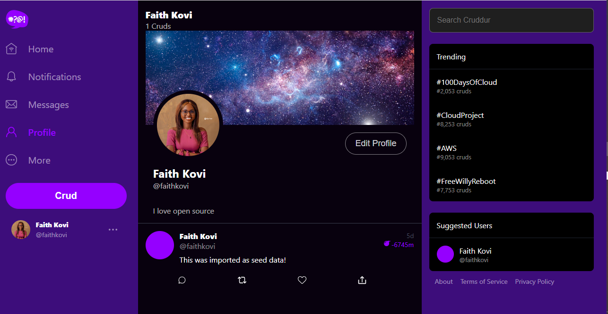

# Week 8 — Serverless Image Processing

## Implement CDK stack
### Create a new directory
Create a new directory in the top level directory which will contain all the cdk pipeline content

```sh
cd /workspace/aws-bootcamp-cruddur-2023
mkdir thumbing-serverless-cdk
```
### Install CDK globally

This is so we can use the AWS CDK CLI for anywhere.

```sh
npm install aws-cdk -g
```

We'll add the the install to our gitpod task file
```sh
  - name: cdk
    before: |
      npm install aws-cdk -g
```
## Initialize a new project

We'll initialize a new cdk project within the folder we created:

```sh
cdk init app --language typescript
```
Create ```env.example``` file and install the ```dotenv``` package
```
touch .env.example
npm install dotenv
```

### Create s3 bucket to store assets
Manually create a S3 bucket named, ```assests.<domain_name>``` for serving processed images in the profile. 

### Update Env variables
```sh
export DOMAIN_NAME=faithkoviproject.store
gp env DOMAIN_NAME=faithkoviproject.store
export UPLOADS_BUCKET_NAME=faithkoviproject-cruddur-uploaded-avatars
gp env UPLOADS_BUCKET_NAME=faithkoviproject-cruddur-uploaded-avatars
```
### Image processing
To process the uploaded images, create a lambda function
```sh
mkdir -p aws/lambdas/process-images
cd aws/lambdas/process-images
touch index.js s3-image-processing.js test.js  example.json
npm init -y
npm install sharp @aws-sdk/client-s3
```
Ensure it works by running the following commands
```sh
cd /workspace/aws-bootcamp-cruddur-2023
mkdir -p bin/avatar
cd bin/avatar
touch build upload clear
chmod u+x build upload clear
mkdir files
```
Ensure sharp dependency works
```sh
./bin/avatar/build
cd thumbing-serverless-cdk
```


### Stacks 
Update the stacks to create the following: S3 bucket, Lambda, SNS topic, SNS subscription, S3 event notification to SNS, S3 event notification to Lambda, policy for bucket access, policy for publishing, Attach the policies to the Lambda role.

###  Bootstrapping

> Deploying stacks with the AWS CDK requires dedicated Amazon S3 buckets and other containers to be available to AWS CloudFormation during deployment. 

```sh
cdk bootstrap "aws://$AWS_ACCOUNT_ID/$AWS_DEFAULT_REGION"
```

### Build

We can use build to catch errors prematurely.
This jsut builds tyescript

```sh
npm run build
```


### Synth

> the synth command is used to synthesize the AWS CloudFormation stack(s) that represent your infrastructure as code.

```sh
cdk synth
```
## Deploy

```sh
cdk deploy
```

## List Stacks

```sh
cdk ls
```

## Serve assets via Cloudfront
Create a cloudfront distribution by setting the origin domain to be ```assets.<domain_name>```
Use the ACM created previously as the Custom SSL certificate
Ensure a record is created in Route53 ```assets.<domain_name>``` with an alias pointing to the cloudfront distribution.

## Update/Create codes for the profile page implementation
update the necessary codes for the profile page implementation

## Database migration
Database migration is required since previously there was no column named ```bio``` 
Run the script
```
./bin/generate/migration add_bio_column
```
After Creating the executable scripts `bin/db/migrate` and `bin/db/rollback`, run the scripts
To migrate
```
./bin/db/migrate
```
To roll back
```
./bin/db/rollback
```

## Implement HTTP API Gateway using a lambda authorizer 
Create an API gateway with its invoke URL having this format - `https://<API_ID>.execute-api.<AWS_REGION>.amazonaws.com`
To successfully implement this: 
### Implement a ruby function to generate a presigned URL
- Create a basic `function.rb` in `aws/lambdas/cruddur-upload-avatar/` and run `bundle init`; edit the `Gemfile` that was generated and run `bundle install` and `bundle exec ruby function.rb` afterwards; a presigned url can be generated for testing. The code `function.rb` displays the actual `function.rb` utilized in CruddurAvatarUpload.
- In `aws/lambdas/lambda-authorizer/`, make `index.js`, run `npm introduce aws-jwt-check - - save`, Download everything in this folder and zip it, then upload it to the lambda function `CruddurApiGatewayLambdaAuthorizer`

## Testing
Run the following commands in the terminal

```sh
cd /workspace/aws-bootcamp-cruddur-2023
./bin/bootstrap
docker compose up
./bin/prepare
```
## Proof

