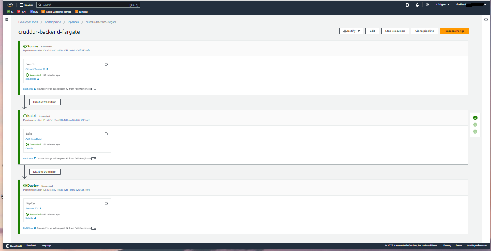

# Week 9 — CI/CD with CodePipeline, CodeBuild and CodeDeploy

## Create a buildspec.yml file
Create a buildspec.yml file in the `backend-flask` directory
 ```yaml
 # Buildspec runs in the build stage of your pipeline.
version: 0.2
phases:
  install:
    runtime-versions:
      docker: 20
    commands:
      - echo "cd into $CODEBUILD_SRC_DIR/backend"
      - cd $CODEBUILD_SRC_DIR/backend-flask
      - aws ecr get-login-password --region $AWS_DEFAULT_REGION | docker login --username AWS --password-stdin $IMAGE_URL
  build:
    commands:
      - echo Build started on `date`
      - echo Building the Docker image...          
      - docker build -t backend-flask .
      - "docker tag $REPO_NAME $IMAGE_URL/$REPO_NAME"
  post_build:
    commands:
      - echo Build completed on `date`
      - echo Pushing the Docker image..
      - docker push $IMAGE_URL/$REPO_NAME
      - cd $CODEBUILD_SRC_DIR
      - echo "imagedefinitions.json > [{\"name\":\"$CONTAINER_NAME\",\"imageUri\":\"$IMAGE_URL/$REPO_NAME\"}]" > imagedefinitions.json
      - printf "[{\"name\":\"$CONTAINER_NAME\",\"imageUri\":\"$IMAGE_URL/$REPO_NAME\"}]" > imagedefinitions.json

env:
  variables:
    AWS_ACCOUNT_ID: **********
    CONTAINER_NAME: backend-flask
    IMAGE_URL: **********.dkr.ecr.us-east-1.amazonaws.com
    REPO_NAME: backend-flask:latest
artifacts:
  files:
    - imagedefinitions.json
 ```
> Create a branch named `prod` that will be used for the pipeline
## Configure CodeBuild Project
Create a build project named `cruddur-backend-flask-bake-image` , choose the source provider as Github with the source version pointing to the `prod` branch. Ensure the event type is `PULL_REQUEST_MERGED` and specify the  buildspec file `backend-flask/buildspec.yml`. Turn on cloudwatch logs, set the group name is `/cruddur/build/backend-flask`, and the stream name is `backend-flask` for easy identification.
For the role attached to codebuild add a policy for ECR `aws/policies/ecr-codebuild-backend-role-policy.json`
## Configure AWS CodePipeline
Create a pipleline named `cruddur-backend-fargate` with source stage from Github Version 2 connected to the cruddur repo branch `prod`. Select Codebuild for the build stage and the new project created `cruddur-backend-flask-bake-image`. Select ECS for the deploy stage, choose the cluster previusly created `cruddur` and the service `backend-service`
## Testing the AWS CodePipeline
To test the pipeline, make a change to the healthcheck in  `backend-flask/app.py ` to return `{"success": True, "ver": 1}, 200`
create a new pull request. 
### Proof of pipeline working


